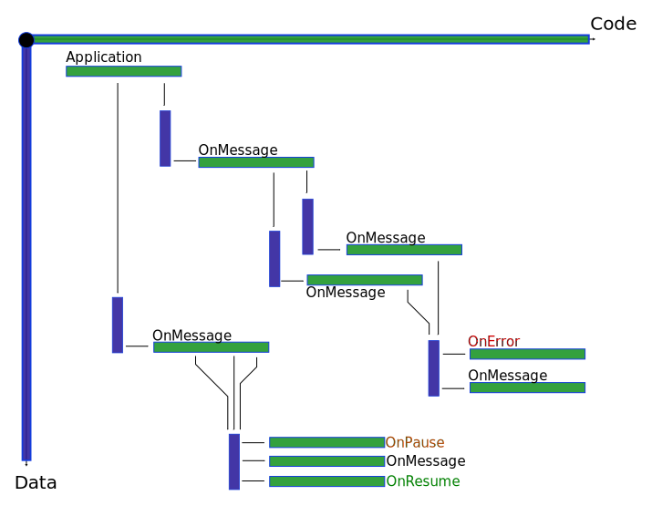

# codegrid
Implement messages and asynchronous programming in Node.js and browser Javascript.
An alternative to callbacks and promises, easy to read, easy to expand.
##### Status: Under construction! Stable version coming soon
Do not use in production, it will not work yet.
Keep in mind than the present documentation is constantly changing until declared stable.
Please contact the author if you have any suggestions or if you feel that you can contribute.

## Table of Contents

*	[Introduction](#introduction)
*   [Definitions](#definitions)
*   [Examples](#examples)
	* [Example 1](#example-1) Include _codegrid_ in a Node.js module
	* [Example 2](#example-2) Perform a simple callback without arguments
	* [Example 3](#example-3) Two functions that call the same callback function
	* [Example 4](#example-4) Callback passing a plain string
	* [Example 5](#example-5) Callback passing a complex object
	* [Example 6](#example-6) Replacing a callback hell
	* [Example 7](#example-7) Serial execution #1 (collect and process data, then output result)
	* [Example 8](#example-8) Serial execution #2 (collect data, then process data, then output result)
	* [Example 9](#example-9) Parallel execution
	* [Example 10](#example-10) Recursively read folder contents
*   [API](#api)
	* `Object` Library object returned by require('codegrid')
		*  `Property` channel([options])
		*  `Property` message(channel[,message])
		*  `Property` messages(channel,messages)
		*  `Property` pause(channel[,count])
		*  `Property` resume(channel)
		*  `Property` flush(channel)
		*  `Property` next(channel,nextChannel)
	* `Object` Structure object required in channel()
		*  `Property` [type]
		*  `Property` [structure]
		*  `Property` [optional]
		*  `Property` [min]
		*  `Property` [max]
	* `Object` Channel object returned by channel()
		*  `Property` message([message])
		*  `Property` messages(messages)
		*  `Property` pause([count])
		*  `Property` resume() 
		*  `Property` flush() 
		*  `Property` next(nextChannel) 
		*  `Property` onConsume(function) 
		*  `Property` onError(function) 
		*  `Property` onPause(function) 
		*  `Property` onResume(function) 


## Introduction

**codegrid** is a lightweight framework designed to simplify Javascript asynchronous programming, both in web browser and server (node.js). It is very easy to learn and very easy to build large scale applications with. It can be used to synchronize data between code in the same module, in different modules, between a server and web browser or between two servers.

While promises implement asynchronous programming by giving emphasis on code, _codegrid_ attempts a different approach by moving the weight on data. This gives _codegrid_ an advantage when building large scale applications, because the art of programming is more mature for creating large quantities of data than creating large quantities of code. Increasing the code can lead quickly to applications that are very difficult to maintain. On the other side, increasing the data is a simpler process, as long as we follow two important principles: Define well and repeat often our data structures.

Also, task automation becomes easier when information is kept in data rather than in code.

To understand how codegrid works, imagine that an application can be drawn in a two-dimensional diagram:
- The X-axis of the diagram is the code flow, while the Y-axis is the data flow. 
- A sequence of code instructions is drawn as a horizontal narrow rectangle: Code inside the sequence executes from left to right.
- A queue of data objects is drawn as a vertical narrow rectangle: Data items are received on the queue top and they are consumed sequentially on the queue bottom.
- Arrows from codes to queues indicate the points where functions send data to the queues.
- Arrows from queues to codes indicate the event handlers that fire on queue events.
- The X-axis code is by its nature synchronous, while the Y-axis data is by its nature asynchronous.



## Definitions
- __channel__  A data queue with event handlers
A channel receives messages or control signals.
- __message__  A data object send to a channel
Messages are stored to the channel message queue. 
When a message in queue is ready for consumption, it is removed from the queue and consumed by the consume handler function.
- __signal__ A special control message sent to a channel.
Signals may be processed immediately or may be stored in a separate signal queue to be processed later.
Signal types are:
	- __pause__  Processed immediately. Channel enters the paused state. Consuming is stopped.
	- __resume__ Processed immediately. Channel returns to the normal state. All pending data messages are consumed.
	- __flush__  Processed immediately. Channel returns to the normal state. All pending data messages are flushed without consuming.
	- __next__  An argument (nextChannel) is also provided. Pass nextChannel 
There are two types of messages: 
	- __data message__  An object sent from any code to the channel.
	- __control message__  A special object 
	A data object with a specific structure. 
Messages are sent from code to channels, where they are consumed.
All data messages that arrive to a channel must have the same structure.
- __channel state__
A channel can be in one of the following operation states: 
	- __normal state__ Data messages are consumed as soon as possible.
	- __paused state__ Data messages are stored to be consumed later.
- __control message__
A channel may receive one of the following controll messages:
- __event handler__ 
A function that fires when a specific condition occurs in a channel:
	- __message handler__ Fires to consume a data message and remove it from the queue
	- __error handler__ Fires when an error occurs inside a handler
	- __pause handler__ Fires when a pause control message is received
	- __resume handler__ Fires when a resume control message is received
- __channel scope__  
A special data container in channel for storing local variables, accessible from handlers.
A message handler may process the incoming messages and keep some data here.

## Examples

###### Example 1
##### Include _codegrid_ in a Node.js module
```js
var cg = require('codegrid');
```

###### Example 2
##### Perform a simple callback without arguments
```js
// A executes first, then B executes

function A() {
	// ... 
    cg.message(channel);	// Send message to channel when A is finished
}

var channel = cg.channel({	// Create an anonymous channel
	onConsume: function B(){ // Fired to consume a received message
    	// ... 
    }
});
```

###### Example 3
##### Two functions that call the same callback function
```js
// Callback B executes after either execution of A1 or A2

function A1() { 
	// ... 
	cg.message('channel1');
}

function A2() { 
	// ... 
	cg.message('channel1');
}

cg.channel({	// Create a named channel
	name: 'channel1',
	onConsume: function B(){
    	// ... 
    }
});
```

###### Example 4
##### Callback passing a plain string
```js
// A executes first, then passes a string to B, then B executes

function A() {
	// ... 
    cg.message(channel,'done');
}

var channel = cg.channel({	// Create an anonymous channel
	structure: 'string',
	onConsume: function B(s) {
    	console.log(s);
    }
});
```

###### Example 5
##### Callback passing a complex object
```js
// A executes first, then sends an object to channel, 
// then channel validates the object, then B consumes the object

function A() {
	// ... Read a person from database to ...
    person.source = 'database'; // Add some more info to person
    cg.message(persons,person);	// Send person to B
}
var persons = cg.channel({	// Create an anonymous channel for consuming persons
	structure: {	// Define properties of data message:
    	id: 'integer',	// Person ID
        name: {type:'string',min:2,max:50},	// Person name (2...50 characters)
        age: {type:'integer',min:12,optional:true}, // Optional person age (12...)
        source: 'string',	// Information about where the person came from
        address: {	// Person address 
        	type: 'object',			// address is an object...
            structure: {			//  ...with the following properties:
	        	street: 'string',
	            streetNo: 'string',
	            zip: 'string',
	            city: {type:'string', optional:true},
             },
        },
        activities: { // An optional array with activities info
        	type:'array',
			structure: {
        		activityId: 'integer',	// Activity ID
                startDate: 'date',		// Activity start date
                endDate: {type:'date',optional:true}, // Activity end date
                subActivities:{	// Optional sub-activities
                	type: 'array',
                    optional: true,
                    structure: 'integer',
                	},
                },
        	max:10,
            optional:true
        },
    },
	onConsume: function B(person){ // Called when a valid message is received
    	// Person is guaranteed to have the defined structure
    	console.log(person.name,person.address.street,person.address.streetNo);
    },
    onError: function (error) {	// Called if validation fails or if an exception occurs in message handler
    	console.log(error);
    }
});
```

###### Example 6
##### Replacing a callback hell
```js
// Chain call of A,B,C,D
// B output is a (x,y) object that is passing to C as input message
// C output is processed by the application before sending it to D

function A(callback) {
	// ... 
    if (callback)
    	callback();
}

function B(callback) {
	// ...
    if (callback)
    	callback({x:100,y:50});
}

function C(msg,callback) {
	console.log(msg.x,msg.y);	// 100,50
    if (callback)
    	callback(5);
    // ...
}

function D(result) {
	console.log(result);	// 7
}

var chA = cg.channel({onConsume: A});
var chB = cg.channel({onConsume: B});
var chC = cg.channel({
	structure: {type:'object',structure:{x:'integer',y:'integer'}},
	onConsume: C,
});
var chD = cg.channel({
	structure: 'integer',
	onConsume: D
});

// Define a temporal execution chain
chA.callback(chB); // Consume chA using callback, then take back the result and send it to next channel
chB.callback(chC);
chC.callback(chD, function(msg,callback){callback(msg+2)});

// Start the execution chain
chA.message();

```

###### Example 7
##### Serial execution (collect and process data, then output result)
```js
// Add numbers from 1 to 100, show the result

var channel = cg.channel({ 	// Channel to perform the addition
	structure:'integer',	// Data messages will be integers
    scope: {sum:0},			// Calculate sum here
    onConsume: function (n,scope) { // Executes when a message is received
    	scope.sum += n;
    },
    onResume: function(scope) {
    	console.log(scope.sum);
    },
});

// Add numbers
for (var i=0;i<100;i++) {
	cg.message(channel,i);
}

// Show result
cg.resume(channel);	
```

###### Example 8
##### Serial execution (collect data, then process data, then output result)
```js
// Add numbers from 1 to 50, show the result

var channel = cg.channel({ // Channel to perform the addition
	structure:'integer',	// Data messages will be integers
    scope: {sum:null},  // We can init scope later
    onConsume: function (n,scope) { // Consume each data message (after resuming)
    	scope.sum += n;
    },
    onPause: function(scope) { // Executes when pausing
    	scope.sum = 0;
    },
    onResume: function(scope) { // Executes when resuming
    	console.log(scope.sum);
    },
});

// Pause channel. Numbers are stored, but they are not added yet
cg.pause(channel);

// Collect numbers
for (var i=0;i<50;i++) {
	cg.push(channel,i);
}

// Resume channel. Numbers are added, then sum is displayed
cg.resume(channel);
```

###### Example 9
##### Parallel execution
```js
// Execute A 2 times and B 3 times, then execute C

var ch = cg.channel();

function A() {
	// ...
    ch.message();
}

function B() {
	// ...
    ch.message();
}

function C() {
	// ...
}

ch.onResume = C;
ch.pause(5);
A();
B();
A();
B();
B();
ch.resume();

```

###### Example 10
##### Recursively read folder contents
```js
cg.channel({	
	name:'folderContents',
    structure: {
    	folders: {
        	type: 'array',
            structure: {
            	name: 'string',
                contents: {type:'folderContents'}
            },
        },
        files: {
        	type: 'array',
            structure: {
		    	name: 'string',
		        size: 'integer',
                modified: 'datetime',
            },
        },
    },
    onConsume: function(plainString) { //Called whenever there is an incoming message
		console.log(plainString);	// Perhaps do some asynchronous work here
		cg.message('channelB',plainsString);	// Done, send a message to another channel
    }
});

// Mix with callbacks
fs.readdir('*.pdf',function(err,files){
	files.forEach(function(file){
		cg.message('countFile');
    });
});

```

## API
- __Library object returned by require('codegrid')__ `Object` 
	- __channel__([options]) `Property`
	Create a new channel or search by name for an already existing channel.  Return the channel object.
	channel() creates a new anonymous channel.
	channel(options) creates a new channel or returns an existing one.
        - __options__ `Argument`
        Determine the channel properties or search for an existing channel.
       	If options is a string, an existing channel with this name will be returned (or null if no such channel exists).
       	If options is an object, it may contain the following properties that define the channel behaviour:
        	- __name__ `Property` (optional)
			A unique string identifier for the new channel.
		    If a channel with that name exists, an error will occur.
		    If omitted (anonymous channel), a unique name will be generated.
			- __structure__ `Property` (optional)
	        Defines the structure of the data messages handled by this channel.
            If object, see Structure object below for available properties.
		    If string, data message must be a single variable of this type. See property .type of Structure object for available types.
			- __scope__ `Property` (optional)
		    Object whose properties will be variables local to the channel and accesible by its event handlers.
            If omitted, an empty scope {} will be created.
            If present, scope will be initialized with this value.
	    	- __onConsume__([message]) `Property` (optional)
	        Event handler function which is fired to consume a message.
            If omitted, no consuming will be performed and messages are silently discarded.
            The _this_ keyword inside the function refers to the channel object.
            	- __message__  `Argument` (optional)
            	The received message. Omitted if channel receives empty messages or if message is optional and missing.
			- __onError__(error) `Property` 
		    Error handler fired when an error occurs.
            If omitted and an error occurs, an exception is thrown.
            	- __error__  `Argument`
            	Error object contains details about the error. It may contain the following properties:
            		- __message__ `Property` (optional)
            		The received message. Omitted if error did not occured in consuming or if channel structure is not defined.
                    - __scope__  `Property`
                    The channel scope.
                    - __self__  `Property`
                    This channel.
                    - __next__  `Property` (optional)
                    The name of the channel that should be notified. 
                    Omitted if no pending next signal exists or if error did not occured in consuming.
	        - __onPause__(scope) `Property` (optional)
	        onPause() is fired when channel enters in paused state.
	    	- __onResume__([scope]) `Property` (optional)
		    onResume() is fired when channel leaves paused state and all pending messages have been consumed.
	        If sending a resume control message while in normal state, the channel will consume any previous data messages and then will fire onResume().
		- __Returns__
		A channel object.
        If an error occured in channel creation, channel.error holds the error details.
	- `Property` __message__(channel[,message])
		- __Purpose__
		Sends a data message to a channel
		- __Usage__
			- message(channel) sends an empty data message to a channel. Channel should allow only empty data messages.
			- message(channel,message) sends a data object to a channel. Data object must be valid according to the channel structure.
        - `Argument` [__channel__]
        The channel to send the data.
        If string, it is the channel name.
        If object, it is the channel object returned from .channel()
        - `Argument` [__message__]
        The data object to send to the channel.
        When channel receives the message, it will perform validations to check if it complies to the declared structure for the objects handled by that channel.

	- `Property` __messages__(channel,messages)
		- __Purpose__
		Sends an array of data messages to a channel
		- __Usage__
			- messages(channel,n) sends n empty data message to a channel, where n is an integer. 
			- messages(channel,arr) sends some data messages to a channel, where arr is an array containing data messages.
        - `Argument` [__channel__]
        The channel to send the data.
        If string, it is the channel name.
        If object, it is the channel object returned from .channel()
        - `Argument` [__messages__]
        If messages is a number, it is the number of empty data messages to send.
        If messages is an array, it contains the data messages to send.

	- `Property` __pause__(channel[,count])
		- __Purpose__
		Sends a pause control message to set the channel in paused state.
        Channel enters the paused state and onPause handler fires.
        When in paused state, channel will receive and store messages but will not consume them.
		- __Usage__
			- pause(channel) sends a pause control message. Channel will resume to normal state after receiving a resume/flush control message.
			- pause(channel,count) sends a pause control message to set channel in paused state for a predefined number of data messages. After receiving the predefined number of data messages, channel will resume automatically and return to the normal state, without requiring a resume control message.
        - `Argument` [__channel__]
        The channel to send the data.
        If string, it is the channel name.
        If object, it is the channel object returned from .channel()
        - `Argument` [__count__]
        The number of data messages to receive before resuming automatically.
        If count is 0 or null, a resume control signal will be added immediately in the queue.

	- `Property` __resume__(channel)
        - __Purpose__
        Sends a resume control message to set the channel in normal state. 
        If there are any data messages pending, they are consumed in the order they were arrived.
        The onResume handler fires then and the channel enters the normal state.
        - __Usage__
            - resume(channel) sends a resume control message.
        - `Argument` [__channel__]
        The channel to send the data.
        If string, it is the channel name.
        If object, it is the channel object returned from .channel()

	- `Property` __next__(channel,nextChannel)
        - __Purpose__
        Sends a next control message to a channel to set the channel in next state. 
        When a channel is in next state and a message arrives, the onNext handler is executed, passing nextChannel as the first argument.
        - __Usage__
            - next(channel,nextChanner) sends a next control message.
        - `Argument` [__channel__]
        The channel to send the data.
        If string, it is the channel name.
        If object, it is the channel object returned from .channel()


- `Object` __Structure object required in channel()__
    - `Property` __[type]__
    String that indicates the data type. Available types are:
        - __string__ Data must be a string
        - __integer__ Data must be an integer
        - __number__ Data must be a number
        - __datetime__ Data must be a Datetime object
        - __boolean__ Data must be a boolean
        - __array__ Data must be an array. Structure of array items is determined by property _structure_
        - __object__ Data must be an object. Object properties are defined in property _structure_
    - `Property` __[structure]__
    Variable with different meanings, depending on type:
        - If type is __object__, structure is an object defining the available properties for data. 
        Property key is the name of the property in data.
        Property value is a Structure object that defines the rules for the property value in data.
        - If type is __array__, structure is a Structure object that defines the rules for each array item in data.
    - `Property` __[optional]__
    If exists and it is true, then this value is optional.
    If omitted, then this value is required.
    - `Property` __[min]__
    Variable with different meanings, depending on type:
        - If type is __string__, min is an integer defining the minimum acceptable number of characters in data
        - If type is __integer__, min is an integer defining the minimum acceptable value of data
        - If type is __number__, min is a number defining the minimum acceptable value of data
        - If type is __datetime__, min is a datetime defining the minimum acceptable value of data
        - If type is __array__, min is an integer defining the minimum acceptable length of the array items
    - `Property` __[max]__
    Variable with different meanings, depending on type:
        - If type is __string__, max is an integer defining the maximum acceptable number of characters in data
        - If type is __integer__, max is an integer defining the maximum acceptable value of data
        - If type is __number__, max is a number defining the maximum acceptable value of data
        - If type is __datetime__, max is a datetime defining the maximum acceptable value of data
        - If type is __array__, max is an integer defining the maximum acceptable length of the array items
       	
- `Object` __Channel object returned by channel()__
    - __message__([message]) `Property` Like the library object method, except that channel is the object itself.
    - __messages__([messages]) `Property` Like the library object method, except that channel is the object itself.
    - __pause__([count]) `Property` Like the library object method, except that channel is the object itself.
    - __resume__() `Property` Like the library object method, except that channel is the object itself.
    - __flush__() `Property` Like the library object method, except that channel is the object itself.
    - __next__ `Property` (optional)
    A string with the name of the channel to notify after consuming is done. 
    The consume handler is responsible to read this property and send messages to the appropriate channel. 
    When a _next_ control message is received, the nextChannel of the message is written to this property. 
    When a message is consumed
    - `Property` [__onConsume__(function)]
    Define the consume event handler
    - `Property` [__onError__(function)]
    Define the error event handler
    - `Property` [__onPause__(function)]
    Define the pause event handler
    - `Property` [__onResume__(function)]
    Define the resume event handler

